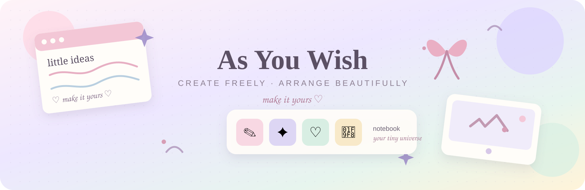
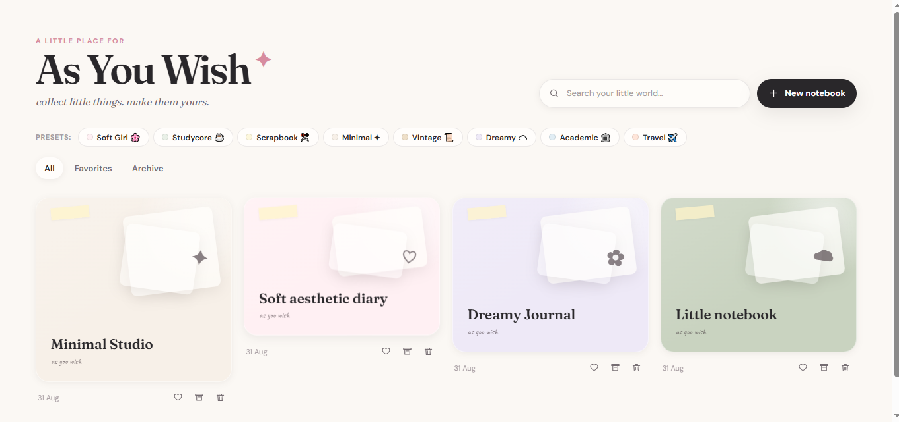

<div align="center">



# 🎀 As You Wish

### **Create Freely. Arrange Beautifully. Make It Yours.**

*A playful, local-first digital notebook and infinite creative canvas for notes, memories, doodles, images, stickers, shapes and tiny pieces of inspiration.*

[](https://chillingbing648-sketch.github.io/As-you-wish/)
[](https://github.com/chillingbing648-sketch/As-you-wish)
[](https://react.dev/)
[](https://www.typescriptlang.org/)
[](https://vite.dev/)
[](https://zustand.docs.pmnd.rs/)

**♡ Digital Notebook · Infinite Canvas · Scrapbook · Drawing · Stickers · Memories ♡**

</div>

---

## 🌷 At a Glance

| | |
|---|---|
| **Product** | Creative notebook + infinite canvas |
| **Frontend** | React `19.2.8` + TypeScript `~6.0.2` |
| **Build** | Vite `8.2.2` |
| **State** | Zustand `5.0.15` |
| **Persistence** | IndexedDB via `idb` `8.0.3` |
| **Linting** | Oxlint `1.79.0` |
| **Deployment** | GitHub Actions → GitHub Pages |
| **Status** | MVP / Active Creative Development |

---

# ✨ Real Application Preview

<div align="center">

<a href="https://chillingbing648-sketch.github.io/As-you-wish/">
  
</a>

<br>

**👆 Click the preview to open the live application**

<sub>Preview sourced directly from the repository's <code>Preview.png</code>.</sub>

</div>

---

# 🎀 What is As You Wish?

**As You Wish** is built around one simple idea:

> ### *Your workspace should feel like yours.*

Traditional note apps give you boxes. Whiteboards give you space. Scrapbooks give you personality.

**As You Wish brings those ideas together in one playful canvas.**

Write something down. Drop in a photo. Draw over it. Add a sticker. Move everything around. Resize it. Rotate it. Layer it. Lock it. Change the paper.

```text
                 a thought
                     ↓
                  ✎ a note
                     ↓
                🖼 a memory
                     ↓
                ♡ a sticker
                     ↓
                 ✧ a doodle
                     ↓
               ✦ a shape
                     ↓
            "okay... that's cute"
                     ↓
               another idea
```

**You bring the thought. You decide where it goes. The canvas does the rest.** ♡

---

# ⚡ Core Features

### 📓 Notebook Library
Create notebooks with titles, cover colors, favorites, archive state and dedicated canvas documents.

### 🪐 Infinite Canvas
A camera-based world coordinate system supports pan, wheel/pinch zoom, zoom-at-point and fit-to-content behavior. The camera supports `0.1×`–`4×` zoom.

### ✎ Rich Text
Text objects support font family, size, weight, bold, italic, underline, strikethrough, color, background, highlights, alignment, letter spacing, line height and heading styles.

```text
H1 · H2 · H3 · Body · Quote · Handwritten · Caption
```

### 📝 Notes
Lightweight sticky-note objects for visual, low-friction writing.

### 🎨 Drawing Studio
SVG-path drawing with pencil, ballpoint, fountain, marker, highlighter, brush and eraser tools, plus stroke color, width, opacity, line caps and joins.

### 🖼️ Images & Scrapbook Frames
Image objects support:

- Polaroid / Paper / Tape / Film / Torn frames
- Captions
- Opacity, borders and shadows
- Grayscale / Warm / Cool / Fade / Vivid filters
- Brightness, contrast and saturation
- Horizontal / vertical flip
- Crop coordinates

### 🧸 Stickers & Decorations
Symbols, emojis and decorative elements can be positioned, resized, rotated, layered, locked, hidden and deleted like other canvas objects.

### ✦ SVG Shapes
Rectangle, circle, rounded rectangle, triangle, star, line, arrow, speech bubble and divider.

### 🎨 Creative Studios
Focused editing surfaces include **Colour Studio, Font Studio, Image Edit Panel, Drawing Panel, Emoji Studio, Decorations Drawer, Alignment Toolbar, Layer Panel, Quick Create, Template Gallery, Saved Elements** and **Keyboard Shortcuts**.

### 📄 Paper Collection
```text
Blank · Dotted · Grid · Lined · Paper · Pink · Lavender · Sage · Sky
```

---

# 🧠 Data Model

The typed domain model is centered on a shared `CanvasObjectBase`:

```text
CanvasObjectBase
│
├── Text
├── Note
├── Image
├── Drawing
├── Sticker
└── Shape
```

Common object metadata includes:

```text
id · x · y · width · height · rotation · zIndex
locked · hidden · createdAt · updatedAt · groupId · label
```

Specialized object data covers text styling, image transforms, SVG drawings, stickers and shape configuration.

---

# 💾 Local-First Storage

The core app uses **IndexedDB** through `idb`, with database name `as-you-wish` and schema version `2`.

```text
┌──────────────────────────────┐
│         IndexedDB            │
├──────────────────────────────┤
│ notebooks                    │
│   └── by-updatedAt            │
│                              │
│ canvases                     │
│   └── by-notebookId           │
│                              │
│ userPrefs                    │
│   └── singleton preferences   │
└──────────────────────────────┘
```

Preferences include recent/favorite colors, saved palettes, favorite/recent fonts and saved elements. Deleting a notebook also removes its associated canvas documents.

> **The core notebook experience does not require a remote database.**

---

# 🏗️ Architecture

```text
                         ┌───────────────────────┐
                         │      AS YOU WISH      │
                         │     React + Vite      │
                         └───────────┬───────────┘
                                     │
            ┌────────────────────────┼────────────────────────┐
            │                        │                        │
            ▼                        ▼                        ▼
     ┌──────────────┐        ┌──────────────┐        ┌──────────────┐
     │ Components   │        │ Canvas Layer │        │ Zustand      │
     │ Library / UI │        │ Camera/Object│        │ Stores       │
     └──────┬───────┘        └──────┬───────┘        └──────┬───────┘
            │                       │                       │
            └───────────────────────┼───────────────────────┘
                                    ▼
                           ┌─────────────────┐
                           │  Typed Domain   │
                           │     Models      │
                           └────────┬────────┘
                                    ▼
                           ┌─────────────────┐
                           │ IndexedDB / idb │
                           └─────────────────┘
```

### 🚀 Interaction performance

Pan, wheel and pinch gestures update the camera imperatively on the DOM during the active interaction, then synchronize the final camera state to Zustand after the gesture settles. This avoids unnecessary React renders on every high-frequency input event.

```text
Pointer / Touch / Wheel
          ↓
   Imperative Camera
          ↓
     DOM Transform
          ↓
    Gesture Settles
          ↓
    Zustand Commit
          ↓
      IndexedDB
```

---

# 🛠️ Technology Stack

| Technology | Purpose |
|---|---|
| ⚛️ **React 19** | UI and component architecture |
| 🟦 **TypeScript 6** | Type-safe application and domain models |
| ⚡ **Vite 8** | Development server and production build |
| 🐻 **Zustand 5** | Lightweight application state |
| 💾 **idb 8** | IndexedDB persistence layer |
| 🎨 **CSS** | Visual system and responsive UI |
| 🖼️ **SVG** | Drawing, shapes and iconography |
| 🔍 **Oxlint** | Fast linting |
| 📦 **gh-pages** | Optional manual deployment script |
| ⚙️ **GitHub Actions** | Automated production deployment |
| 🌐 **GitHub Pages** | Hosting |

Versions reflect the repository's current `package.json`.

---

# 📁 Project Structure

```text
As-you-wish/
│
├── .github/workflows/deploy.yml
├── assets/as-you-wish-header.svg
├── public/favicon.svg
│
├── src/
│   ├── canvas/
│   │   ├── AlignmentToolbar.tsx
│   │   ├── Canvas.tsx
│   │   ├── CanvasObjectNode.tsx
│   │   ├── ColourStudio.tsx
│   │   ├── ContextToolbar.tsx
│   │   ├── DecorationsDrawer.tsx
│   │   ├── DrawingPanel.tsx
│   │   ├── EmojiStudio.tsx
│   │   ├── FontStudio.tsx
│   │   ├── ImageEditPanel.tsx
│   │   ├── LayerPanel.tsx
│   │   ├── QuickCreate.tsx
│   │   ├── SavedElements.tsx
│   │   ├── ShapeObject.tsx
│   │   ├── TemplateGallery.tsx
│   │   ├── useCamera.ts
│   │   └── useObjectGesture.ts
│   │
│   ├── components/
│   │   ├── EditorTopBar.tsx
│   │   ├── Icon.tsx
│   │   ├── KeyboardShortcutsModal.tsx
│   │   ├── Library.tsx
│   │   └── NotebookEditor.tsx
│   │
│   ├── lib/
│   │   ├── db.ts
│   │   ├── fontCatalog.ts
│   │   └── fontLoader.ts
│   │
│   ├── store/
│   │   ├── canvasStore.ts
│   │   ├── notebookStore.ts
│   │   └── prefsStore.ts
│   │
│   ├── styles/
│   │   ├── app.css
│   │   └── tokens.css
│   │
│   ├── types/index.ts
│   ├── App.tsx
│   └── main.tsx
│
├── Preview.png
├── index.html
├── package.json
├── package-lock.json
├── tsconfig.json
├── tsconfig.app.json
├── tsconfig.node.json
└── vite.config.ts
```

---

# 🔄 CI/CD & Deployment

The repository contains a GitHub Actions workflow that runs on pushes to `main` and supports manual dispatch.

```text
Developer
   ↓
git push → main
   ↓
GitHub Actions
   ├─ Checkout
   ├─ Node.js 20
   ├─ npm ci
   ├─ npm run build
   ├─ Configure Pages
   └─ Upload dist artifact
             ↓
      GitHub Pages Deploy
             ↓
          🌐 LIVE
```

---

# 💻 Run Locally

```bash
git clone https://github.com/chillingbing648-sketch/As-you-wish.git
cd As-you-wish
npm install
npm run dev
```

### Production build

```bash
npm run build
npm run preview
```

### Lint

```bash
npm run lint
```

---

# 📈 Engineering Status

| Area | Status |
|---|:---:|
| React 19 Architecture | 🟢 |
| TypeScript Domain Model | 🟢 |
| Notebook Library | 🟢 |
| Infinite Canvas | 🟢 |
| Camera / Zoom / Pan | 🟢 |
| Rich Text | 🟢 |
| Notes | 🟢 |
| Images & Frames | 🟢 |
| Drawing | 🟢 |
| Stickers / Emojis | 🟢 |
| SVG Shapes | 🟢 |
| Layers / Lock / Hide | 🟢 |
| Saved Elements | 🟢 |
| IndexedDB Persistence | 🟢 |
| Preferences | 🟢 |
| Production Build | 🟢 |
| GitHub Pages Deployment | 🟢 |
| Automated Tests | 🟡 |
| Accessibility Hardening | 🟡 |
| Advanced Export / Import | 🟡 |

**Current stage:** MVP / Active Creative Development

---

# 🗺️ Roadmap

### ✓ Built

- [x] Notebook library
- [x] Infinite canvas + camera system
- [x] Rich text and notes
- [x] Images + scrapbook frames
- [x] Image filters, transforms and crop model
- [x] Drawing tools
- [x] Stickers / emojis / decorations
- [x] SVG shapes
- [x] Layers, locking and visibility
- [x] Color palettes and font preferences
- [x] Templates and saved elements
- [x] IndexedDB persistence
- [x] GitHub Pages deployment

### → Next

- [ ] 🧪 Automated component / interaction tests
- [ ] 📤 Export / import workflows
- [ ] 💾 Backup / restore
- [ ] 📦 User-uploaded asset collections
- [ ] 🧽 Expanded drawing tools
- [ ] 🎞️ Expanded image editing
- [ ] 🌙 Dark theme
- [ ] ♿ Accessibility hardening
- [ ] 📱 Further mobile optimization

---

# 🤝 Contributing

```bash
git checkout -b feature/my-feature
npm install
npm run dev
npm run build
npm run lint
git add .
git commit -m "feat: describe your change"
git push origin feature/my-feature
```

Then open a Pull Request.

### Contribution principles

- Keep components focused and reusable.
- Preserve the typed domain model.
- Keep persisted fields backward-compatible where possible.
- Avoid unnecessary React re-renders in gesture-heavy paths.
- Keep the visual language cohesive.
- Verify the production build before opening a PR.

---

# 🔐 Privacy & Storage Philosophy

The core notebook and canvas data layer is **local-first and browser-based**. Notebooks, canvas documents and preferences are persisted through IndexedDB rather than requiring a cloud backend for the core editing experience.

```text
Your Browser
     ↓
As You Wish
     ↓
IndexedDB
 ┌───────────────┐
 │ Notebooks     │
 │ Canvas Docs   │
 │ Preferences   │
 └───────────────┘
```

---

# 📜 License

Please refer to the repository's license information for the applicable licensing terms.

---

# 🔗 Links

<div align="center">

[](https://chillingbing648-sketch.github.io/As-you-wish/)
[](https://github.com/chillingbing648-sketch/As-you-wish)
[](https://github.com/chillingbing648-sketch/As-you-wish/issues)

<br><br>

### ˚₊‧꒰ა ♡ ໒꒱ ‧₊˚

**Create Freely. Arrange Beautifully. Make It Yours.**

`♡` `✦` `୨୧` `✎` `🎀` `🌷` `🧸` `✨`

<sub>Built with React · TypeScript · Vite · Zustand · IndexedDB</sub>

<br>

<sub><i>professional architecture, soft edges, and a suspicious amount of pastel.</i></sub>

</div>
